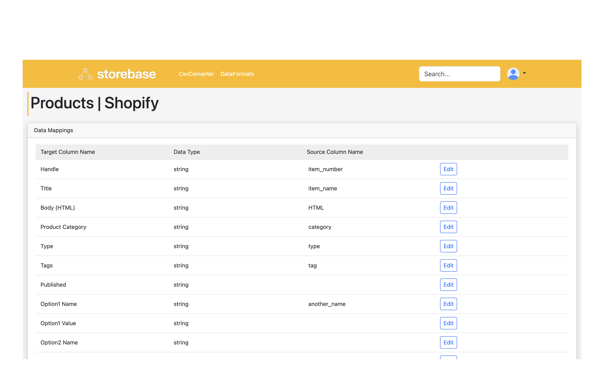

# Storebase

Storebase is a data integration and cross-platform report generation tool for various e-commerce sites. It enables bridging the data format gap between the company database and e-commerce sites, and provides centralized management of sales data when using multiple e-commerce platforms.



## Technical Specifications

Storebase is built with Ruby on Rails. Here are the main dependencies:

- Ruby 3.1.2
- Rails 7

## Installation

Storebase works locally with the following steps:

```bash
# Clone the repository
get clone https://github.com/Naoyuk/storebase.git
cd storebase

# Install Ruby dependencies
bundle install

# Install JavaScript dependencies
yarn install

# Set up the database
rails db:create db:migrate

# Start the server
rails s
```

## Contributing

1. Fork the Project (https://github.com/Naoyuk/storebase/fork)
2. Create your Feature Branch (`git checkout -b my-new-feature`)
3. Commit your Changes (`git commit -am 'Add some feature'`)
4. Push to the Branch (`git push origin my-new-feature`)
5. Open a Pull Request

For bug reports and feature requests, please create an issue on GitHub. Providing detailed information will help solve the problems.

## License

This project is licensed under the MIT License - see the [LICENSE.md](LICENSE.md) file for details.

## Contact

If you have any questions, please feel free to contact us.

## Author

- [@Naoyuk](https://github.com/Naoyuk)
- [Naoyuki Ishida](https://www.naoyuki-ishida.com)

---
Storebase © 2023, All Rights Reserved.
